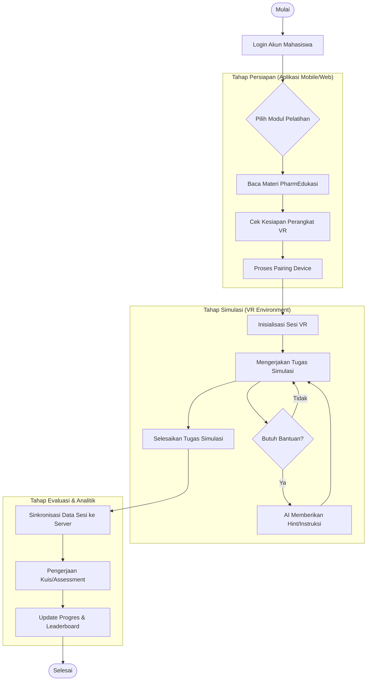
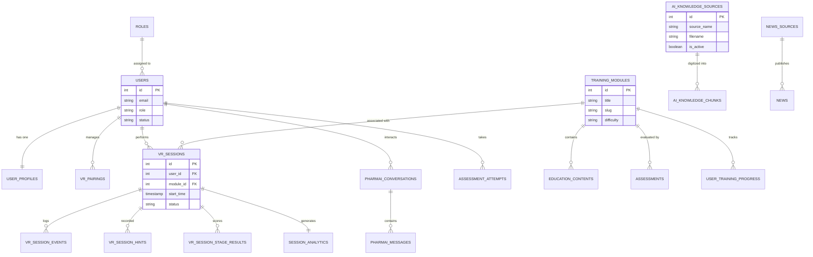

# Desain Sistem: Flowchart dan Entity Relationship Diagram (ERD)

Dokumen ini melengkapi laporan ilmiah dengan detail teknis mengenai alur kerja sistem (Flowchart) dan struktur data (ERD) dari platform **PharmVR Pro**.

---

## 1. Flowchart: Siklus Pembelajaran VR (VR Learning Lifecycle)
Flowchart ini menggambarkan alur kerja pengguna (mahasiswa) mulai dari persiapan materi hingga penyelesaian simulasi VR dan evaluasi.

---

## 2. Entity Relationship Diagram (ERD)
ERD ini merepresentasikan struktur penyimpanan data inti yang saling berhubungan di dalam database PharmVR Pro.

---

## 3. Penjelasan Detail Komponen

### A. Komponen Flowchart
*   **Pairing Device**: Langkah krusial untuk menghubungkan identitas digital pengguna dengan perangkat keras VR yang digunakan.
*   **AI Hints**: Sistem memantau jeda aktivitas pengguna; jika terdeteksi kesulitan, AI akan mengintervensi dengan data dari *Knowledge Base*.
*   **Sinkronisasi**: Data dari Headset (perangkat otonom) dikirim kembali ke aplikasi mobile/web untuk visualisasi kemajuan.

### B. Relasi Database (ERD)
*   **User Centrality**: User menjadi pusat data utama yang menghubungkan riwayat pelatihan (VR Sessions), percakapan AI, dan hasil asesmen.
*   **Module Hierarchy**: Modul pelatihan menjadi wadah yang mengikat materi edukasi, simulasi VR, dan penilaian terkait.
*   **Detailed Logging**: Tabel `VR_SESSION_EVENTS` dan `VR_SESSION_HINTS` memungkinkan audit pengerjaan tugas secara mendalam untuk kebutuhan laporan ilmiah (reabilitas data).

---
*Dokumen ini disusun untuk mendukung bab Perancangan Sistem pada Laporan Ilmiah.*
