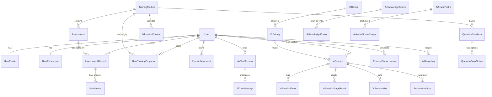
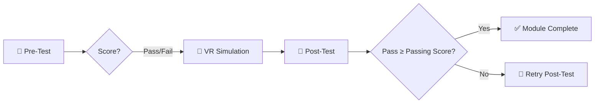
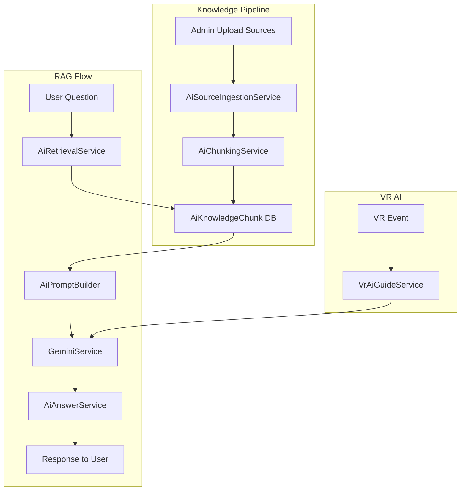
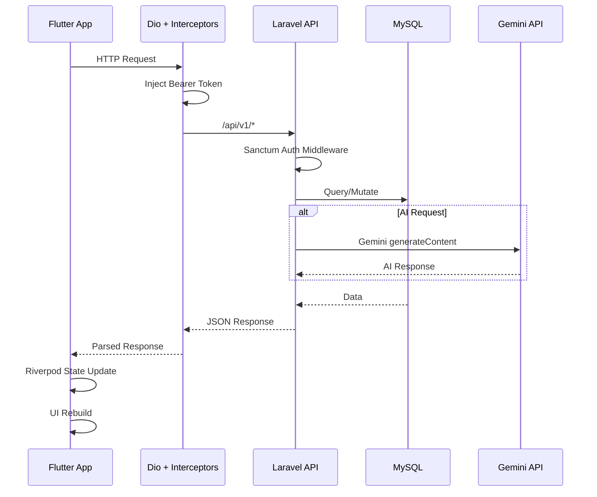

# 📋 PharmVR Pro — Full Project Walkthrough

> Hasil analisis menyeluruh terhadap seluruh codebase frontend (Flutter), backend (Laravel), dan admin panel (Next.js).

---

## 1. Gambaran Umum Project

**PharmVR Pro** adalah platform pelatihan farmasi berbasis **Virtual Reality** yang terdiri dari 3 komponen utama:

| Komponen | Teknologi | Lokasi |
|---|---|---|
| **Mobile App** | Flutter (Dart) + Riverpod | `lib/` |
| **Backend API** | Laravel 12 (PHP 8.2) + Sanctum | `backend/` |
| **Admin Panel** | Next.js 15 + React 19 + TailwindCSS 4 | `admin/` |

---

## 2. Frontend — Flutter Mobile App

### 2.1 Arsitektur

Menggunakan **Clean Architecture** dengan pemisahan layer yang ketat:

```
lib/
├── main.dart                    # Entry point, ProviderScope + MaterialApp.router
├── core/                        # Shared infrastructure
│   ├── config/network_constants.dart   # Base URL (emulator/WiFi/prod)
│   ├── network/
│   │   ├── dio_provider.dart           # Dio HTTP client + interceptors + auth token
│   │   └── api_exception.dart          # Custom exception types
│   ├── router/app_router.dart          # GoRouter dengan StatefulShellRoute
│   ├── theme/                          # Design system
│   │   ├── pharm_colors.dart           # Color palette (dark & light)
│   │   ├── pharm_theme.dart            # ThemeData (dark & light)
│   │   ├── pharm_text_styles.dart      # Typography scale
│   │   ├── pharm_spacing.dart          # Spacing tokens
│   │   └── pharm_radius.dart           # Border radius tokens
│   ├── models/                         # User, UserProfile
│   ├── services/                       # SecureStorageService (flutter_secure_storage)
│   ├── utils/                          # ErrorHandler, Validators
│   ├── widgets/                        # Reusable UI components
│   │   ├── pharm_glass_card.dart       # Glassmorphism card
│   │   ├── pharm_primary_button.dart   # CTA button
│   │   ├── pharm_text_field.dart       # Custom text field
│   │   ├── pharm_network_image.dart    # Cached network image
│   │   ├── pharm_training_journey.dart # Training journey progress
│   │   ├── pharm_settings_ui.dart      # Settings page UI
│   │   ├── scaffolds/                  # Layout scaffolds
│   │   └── states/                     # Empty/error/loading states
│   └── localization/                   # i18n (ID/EN)
└── features/                           # 8 feature modules
```

### 2.2 Feature Modules (Clean Architecture)

Setiap feature mengikuti pattern `data/domain/presentation`:

| Feature | Deskripsi | Screens |
|---|---|---|
| **auth** | Login, Register, Forgot Password, Splash | 4 screens |
| **dashboard** | Home hub + Bottom navigation shell | 2 screens (dashboard, main_shell) |
| **education** | Konten edukasi, video player, document viewer | Multiple screens + widgets |
| **assessment** | Pre-test / Post-test dengan question bank | 4 screens (intro, question, review, result) |
| **vr_experience** | VR pairing, connect, session, progress tracking | 4 screens (launch, connect, summary, progress) |
| **ai_assistant** | PharmAI chatbot (trusted-source AI) | 3 screens (main, chat session, history) |
| **news** | Berita farmasi | List + Detail screens |
| **profile** | Profile, settings, about, help, legal | 9 screens |

### 2.3 State Management

- **Riverpod** (flutter_riverpod) sebagai state management utama
- Pattern: `Provider` → `Notifier<State>` → `NotifierProvider`
- Auth state: `AuthNotifier` mengelola login/logout/register/checkAuth
- Dio interceptor otomatis inject Bearer token dari memory atau secure storage

### 2.4 Routing

- **GoRouter** dengan `StatefulShellRoute.indexedStack` untuk bottom navigation
- 5 navigation branches: **Dashboard**, **Edukasi**, **PharmAI**, **News**, **Profile**
- Custom `_fadeSlide` page transition untuk detail/overlay screens
- Initial route: `/splash` → cek auth → `/dashboard` atau `/auth/login`

### 2.5 Design System

- **Dark-first** design dengan full light theme support
- Primary color: Cyan (#00E5FF) — neon/futuristic aesthetic
- Background: Deep dark slate (#0A0F14)
- Glassmorphism cards, glow effects, smooth animations
- Google Fonts integration
- Custom widgets: GlassCard, PrimaryButton, TextField, LoadingIndicator, dll.

### 2.6 Key Dependencies

| Package | Fungsi |
|---|---|
| `flutter_riverpod` | State management |
| `go_router` | Routing |
| `dio` | HTTP client |
| `flutter_secure_storage` | Token storage |
| `shared_preferences` | Remember me, settings |
| `cached_network_image` | Image caching |
| `shimmer` | Loading skeletons |
| `youtube_player_flutter` | Video playback |
| `webview_flutter` | Document viewer |
| `qr_flutter` | QR code generation (VR pairing) |
| `flutter_markdown` | AI response rendering |
| `google_fonts` | Typography |
| `flutter_svg` | SVG icons |

---

## 3. Backend — Laravel API

### 3.1 Stack

- **Laravel 12** + PHP 8.2
- **MySQL** (database `pharmvr`)
- **Laravel Sanctum** untuk API authentication (token-based)
- **Gemini API** untuk AI features (`GEMINI_API_KEY` di .env)

### 3.2 Database Schema (50 migrations)



### 3.3 Model Utama (36 models)

| Domain | Models |
|---|---|
| **User** | User, UserProfile, UserPreference, Role, Permission |
| **Content** | TrainingModule, EducationContent, News |
| **Assessment** | Assessment, AssessmentAttempt, Question, Option, QuestionBankItem, QuestionBankOption, UserAnswer |
| **VR** | VrDevice, VrPairing, VrSession, VrSessionEvent, VrSessionStageResult, VrSessionHint, VrAiInteraction |
| **AI** | AiKnowledgeSource, AiKnowledgeChunk, AiChatSession, AiChatMessage, AiAvatarProfile, AiAvatarScenePrompt, AiUsageLog, PharmaiConversation, PharmaiMessage |
| **System** | Setting, AuditLog, SessionAnalytics, UserAchievement, UserTrainingProgress |

### 3.4 API Routes (`/api/v1/`)

#### Public Routes
| Method | Endpoint | Fungsi |
|---|---|---|
| POST | `/auth/register` | Registrasi user baru |
| POST | `/auth/login` | Login + generate Sanctum token |
| POST | `/auth/forgot-password` | Kirim reset password link |
| POST | `/auth/reset-password` | Reset password |

#### Protected Routes (auth:sanctum)
| Group | Endpoints | Fungsi |
|---|---|---|
| **Auth** | `GET /auth/me`, `POST /auth/logout` | Session info, logout |
| **Profile** | `GET/POST /profile`, `PUT /profile/password` | CRUD profile, change password |
| **Home** | `GET /home`, `GET /app/settings` | Dashboard data, app settings |
| **Edukasi** | `GET /edukasi`, `GET /edukasi/{slug}` | Learning content list & detail |
| **News** | `GET /news`, `GET /news/{slug}` | News articles |
| **Assessment** | `GET /assessments/{module}/{type}`, `POST /assessments/{id}/start`, `GET/POST /assessment-attempts/{id}/*` | Assessment lifecycle |
| **VR (Mobile)** | `POST /vr/pairings/start`, `GET /vr/sessions/current`, `GET /vr/status`, dll. | VR pairing & sessions dari app |
| **AI Chat** | `GET/POST /ai/conversations/*`, `POST /ai/chat` | PharmAI chatbot |
| **AI Assistant** | `POST /ai-assistant/chat/*`, `GET /ai-assistant/avatar/*` | Trusted-source AI + Avatar guide |
| **Analytics** | `GET /analytics/overview`, `GET /analytics/leaderboard/*`, `GET /analytics/user/progress` | User progress & leaderboard |
| **Admin AI** | `admin/ai/knowledge-sources/*`, `admin/ai/avatars/*` | AI knowledge management |

#### VR Headset Routes (Public, device-token validated)
| Group | Endpoints |
|---|---|
| **Pairing** | `POST /vr/headset/pair` (rate limited) |
| **Heartbeat** | `POST /vr/headset/heartbeat` |
| **Sessions** | `POST /vr/headset/sessions/start`, `PUT /{session}/progress`, `POST /{session}/complete`, dll. |
| **VR AI** | `POST /vr/ai/hint`, `POST /vr/ai/reminder`, `POST /vr/ai/feedback` |

### 3.5 Services Layer

| Service | Fungsi |
|---|---|
| `AuthService` | Register, Login, Forgot/Reset Password, Logout |
| `AssessmentService` | Question randomization, attempt management, score calculation, training progress sync |
| `ProfileService` | Profile CRUD |
| `VrRuleService` | VR business rules |
| **AI Services** | |
| `GeminiService` | Gemini API integration |
| `AiAnswerService` | RAG-based answer generation |
| `AiChatService` | Chat session management |
| `AiAvatarGuideService` | Avatar-guided interactions |
| `AiPromptBuilder` | Prompt construction |
| `AiRetrievalService` | Knowledge retrieval (RAG) |
| `AiSourceIngestionService` | Knowledge source processing |
| `AiChunkingService` | Text chunking for embeddings |
| `VrAiGuideService` | VR-specific AI hints/feedback |

### 3.6 Enums

| Enum | Values |
|---|---|
| `AssessmentType` | PRETEST, POSTTEST |
| `AssessmentStatus` | (active states) |
| `AiSourceStatus` | (processing states) |
| `AiProcessingStatus` | (ingestion states) |
| `ChatPlatform` | (web, mobile, vr) |
| `ChatSender` | (user, assistant) |
| `ChatSessionStatus` | (active, archived) |
| `QuestionUsageScope` | (pretest, posttest, both) |
| `SourceType` | (text, file, url) |
| `TrustLevel` | (trusted, untrusted) |

---

## 4. Admin Panel — Next.js

### 4.1 Stack
- **Next.js 15** (App Router)
- **React 19**
- **TailwindCSS 4** (PostCSS)
- **TypeScript 5**
- **Lucide React** icons

### 4.2 Fitur Admin (via Laravel web routes)
| Modul | Fungsi |
|---|---|
| **Dashboard** | Overview statistik |
| **User Management** | CRUD, ban/unban, force logout |
| **Education** | CRUD konten edukasi, video management, document management |
| **News** | CRUD berita |
| **Assessments** | Kelola assessment per modul, question bank, reset user attempts |
| **Monitoring** | VR sessions, AI interactions, student progress |
| **Reporting** | Training progress, AI analytics, user reports, assessment reports + CSV/PDF export |
| **AI Management** | Knowledge sources, avatars, scene prompts, usage logs |
| **System** | Audit logs, app settings |

### 4.3 RBAC (Role-Based Access Control)
- Middleware: `auth`, `admin`, `throttle:admin`
- Permission-based: `manage-users`, `manage-content`, `view-monitoring`, `manage-system`

---

## 5. Training Journey Flow



> **Key**: Pre-Test adalah **non-binding** — user selalu bisa lanjut ke VR Simulation terlepas dari skor. Post-Test yang menentukan kelulusan modul.

---

## 6. AI Architecture



- **RAG (Retrieval-Augmented Generation)** architecture
- **Gemini API** sebagai LLM backbone
- Knowledge sources: text, file (PDF via `smalot/pdfparser`), URL
- Avatar profiles + scene-specific prompts untuk VR guided intelligence

---

## 7. Data Flow: Frontend ↔ Backend



---

## 8. Environment & Configuration

| Config | Value |
|---|---|
| Flutter SDK | ^3.8.1 |
| Laravel | 12.x |
| PHP | ^8.2 |
| MySQL DB | `pharmvr` |
| Dev Backend URL | `http://10.0.2.2:8000/api/v1` (emulator) |
| Production URL | `https://api.pharmvr.com/api/v1` |
| Auth | Sanctum token-based |
| AI | Google Gemini API |

### Database Seeders (10 seeders)
`DatabaseSeeder` → `AdminUserSeeder`, `UserSeeder`, `RbacSeeder`, `ContentSeeder`, `AssessmentSeeder`, `VrSeeder`, `AiSeeder`, `AiAssistantSeeder`, `SettingSeeder`

---

## 9. Ringkasan Statistik Codebase

| Metric | Count |
|---|---|
| Flutter Feature Modules | 8 |
| Flutter Screens | ~30+ |
| Flutter Shared Widgets | 10+ |
| Backend Models | 36 |
| Backend Controllers | ~25+ |
| Backend Services | 12+ |
| Database Migrations | 50 |
| Database Seeders | 10 |
| API Endpoints | 50+ |
| Admin Web Routes | 30+ |
| Dokumentasi Files | 54 |

---

> [!TIP]
> Project ini sudah sangat mature dengan arsitektur yang well-structured. Setiap penambahan fitur baru sebaiknya mengikuti pattern yang sudah ada: Clean Architecture untuk Flutter, Service Layer untuk Laravel, dan RBAC-aware routes untuk Admin.
